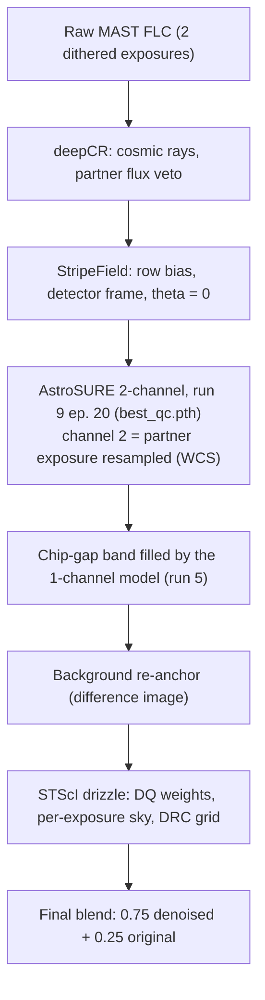
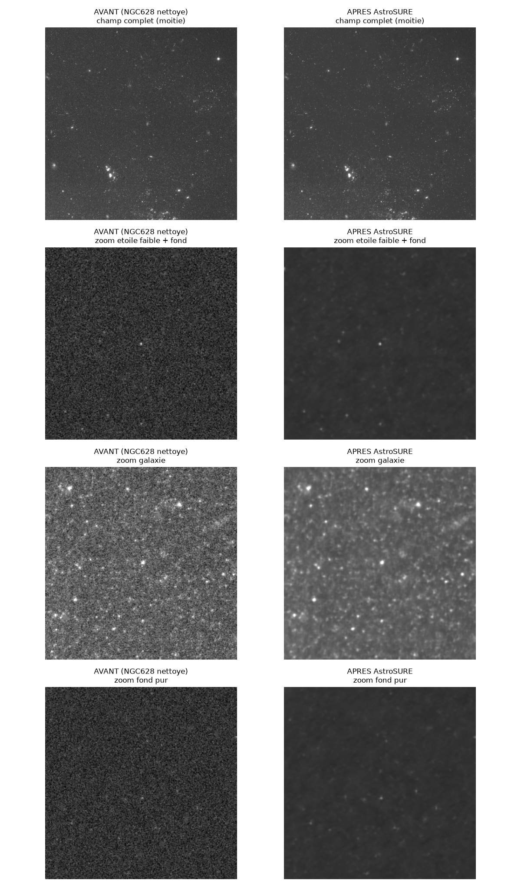

# AstroSURE: Noise2Noise denoising of Hubble ACS/WFC images

**Author:** Benoit Blanco (BB-Astro). **Status (August 2026):** two
production models: run 5 (1 channel, single chip or drizzled image) and
**run 9 epoch 20** (`checkpoints_run9/best_qc.pth`, 2 channels with
stacked targets, pairwise FLC chain: detail 0.890, Gaia 100.4 %,
background ÷32 on Arp 70). House rule: checkpoints are selected by
quality control, never by validation loss.

The idea: train a Noise2Noise model on pairs of dithered Hubble FLC
exposures of the same field, so that denoising a galaxy image takes a
few seconds of inference. No clean reference images are needed: each
exposure serves as the noisy target for the other.


*Arp 70 (HST ACS/WFC F606W, 2×390 s), same drizzle engine and same grid
on both sides, identical absolute stretch per row: only the AstroSURE
denoising differs. Cosmic rays removed without drizzle rejection,
background ÷24, spiral structure and photometry preserved.*

## Production pipeline



Run the whole chain with `pipeline/batch_arp.py`, or step by step
(`deepcr_flc.py`, `destripe_flc.py`, `asure2_flc.py`,
`drizzle_asure.py`); see the Usage section.

---

## Current state (run 5 reference model)

Measured on a full NGC 628 chip, reference stars selected on the
deepCR-cleaned chip (purity 99.9 %):

| Metric | On raw FLC | On deepCR-cleaned FLC |
|---|---|---|
| Background noise | **÷3.79** | **÷3.75** |
| Background photometric offset | +0.02 e- | +0.17 e- |
| Stars 10-30σ | 95.2 % | 95.3 % |
| Stars 30-100σ | 98.4 % | 97.7 % |
| Stars 100-500σ | 98.9 % | 97.2 % |
| Cosmic rays | ~100 % removed | (already absent) |
| Extended sources | intact | intact |


*Full ACS chip of NGC 628, before/after 1-channel denoising (run 5).*

**Important historical correction:** the initial run 5 conclusion
("stars > 30σ erased to 0.3 %") was a measurement artifact. On a raw
FLC, 97 % of the bright PSF-like peaks are cosmic rays: the metric was
measuring their rejection (intended), not star destruction. House rule
since then: NEVER select reference stars on a raw FLC; select them on a
cleaned chip, or require confirmation by the partner exposure.

Measured consequence (run 6): training on deepCR-pre-cleaned data brings
nothing and DEGRADES the denoising (÷2.8-3.0). Training on raw FLC with
an L1 loss and asinh compression handles cosmic rays by itself. Real
remaining limits: 1 to 5 % flux dips on stars; saturated stars and bleed
trails are not guaranteed.

## End-to-end validation (Arp 70)

Full chain FLC → AstroSURE → drizzle (STScI engine) compared with the
official MAST product, at identical absolute stretch:

| Metric (vs the classic chain) | Result |
|---|---|
| High-frequency background | **÷15.8** |
| Low-frequency background | **÷2.6** |
| Stars (20 Gaia DR3 stars, G 14.5-21.2) | **100.2 %** |
| Cosmic rays | 99.9 % removed (without drizzle rejection) |
| ACS striping | 0.64 → 0.11 e- (AstroSURE alone) |

The canonical pipeline order (chain v2) and the detailed run history are
in `PLAN_ENTRAINEMENT.md` (the project's lab notebook, in French).

## Gallery: the Arp series (SNAP program 15446)

Twelve Arp galaxies processed in batch (`pipeline/batch_arp.py`), zooms
at identical stretch per pair:


Equivalence validation against the classic chain: at identical absolute
stretch, the AstroSURE product has the same levels as the official MAST
DRC (identical +0.15σ/−0.05σ inter-chip step on both sides), only
cleaner. Beware of autostretch (PixInsight/STF): keyed to the image σ,
it is ~20× more aggressive on the denoised product and amplifies
residuals that are invisible on the DRC at the same stretch.


---

## Run history (details in PLAN_ENTRAINEMENT.md)

| Run | Change | Verdict |
|---|---|---|
| 1 | baseline | failure: rings (independent A/B normalization) |
| 2 | catalog paths repaired, joint normalization | failure: −107 e- offset, amplified noise |
| 3 | e-/s + per-exposure sky subtraction, no clipping, L1 | instructive failure: background ÷3.7 but stars 99.5 % erased |
| 4 | subpixel target alignment, rotated pairs excluded | same as run 3; the synthetic probe reveals feature saturation |
| 5 | asinh compression (β=1.0) | **1-channel champion** (table above) |
| 6 | training on deepCR-cleaned data | degrades the background (÷2.8-3.0), abandoned |
| 7 | run 5 recipe, larger raw dataset (69 groups) | no improvement, archived |
| 8 | **2 channels + stacked targets** (larger dataset, balanced sampling) | **pairwise FLC production**: detail 0.856 vs 0.793, Gaia 98.2 % (p10 96.9), HF background ÷36 |
| 9 | +30 galaxy units (110 exposures, 9 fields), 100 epochs, **QC-based selection** | **CHAMPION at epoch 20** (`best_qc.pth`): detail 0.890, Gaia 100.4 %, background ÷32; the val loss (epoch 100) picked an over-smoothed model |

Root causes fixed along the way: incoherent N2N pairs (54 % with
different EXPTIME, sky up to ×4 within a group), [0,1] clipping at
training against values of 600 at inference, MSE biased by the ~2 % of
cosmic-ray pixels, half-pixel dithers aligned to the whole pixel,
96 pairs with ~174° relative rotation, uncompressed dynamic range
saturating the U-Net features.

---

## Usage

Python 3.13 with the pinned versions in `requirements.txt` (torch,
astropy, drizzle, deepCR, astroscrappy, astroquery...):

```bash
pip install -r requirements.txt
PY=python

# Check the dataset (890 pairs after rotation filtering)
$PY training/dataset_n2n.py --test

# Training (50 epochs, ~1h50 on an M2 Max, checkpoints/best.pth)
$PY -u training/train.py

# Full-image inference, 1 channel (a few seconds)
$PY training/infer.py input_chip.fits training/checkpoints/best.pth output.fits

# PRODUCTION: full v2 chain on the Arp series (deepCR -> StripeField
# -> AstroSURE run 9 e20 -> drizzle -> 0.75 blend), per target or all
$PY pipeline/batch_arp.py [Arp141 ...]

# Unit steps (2 channels, default model = run 9 e20 QC champion,
# outputs *_asure9e20b.fits next to the inputs)
$PY pipeline/deepcr_flc.py exp1_flc.fits exp2_flc.fits
$PY pipeline/destripe_flc.py exp1_flc_dcr.fits exp2_flc_dcr.fits
$PY pipeline/asure2_flc.py exp1_flc_dcr_dsf.fits exp2_flc_dcr_dsf.fits

# Then drizzle onto the grid of a reference DRC
$PY pipeline/drizzle_asure.py ref_drc.fits output.fits exp1_flc_dcr_dsf_asure9e20b.fits exp2_flc_dcr_dsf_asure9e20b.fits

# 2-channel training (50 epochs, ~2h20 on an M2 Max)
$PY -u training/train.py --mode stack2 --catalog training_data/pairs_catalog_full_raw.json \
    --ckpt-dir training/checkpoints_run9
```

The StripeField destriping engine (`pipeline/destripe_astro.py`) is
vendored from
[BB-Astro Pixinsight_Scripts](https://github.com/BB-Astro/Pixinsight_Scripts)
(same author); set `STRIPEFIELD_DIR` to use an external copy.

Checkpoints archived per run: `training/checkpoints_run2/` …
`_run8_clipbias/`; `training/checkpoints` is a symlink to the 1-channel
champion (run 5, fills the chip-gap band); `training/checkpoints_run9/`
is the 2-channel production model (`best_qc.pth`, epoch 20, QC-selected).

⚠️ The `pairs_catalog*.json` files contain **absolute paths** to the
training data on the author's machine. To train on your side, download
the data with the `download_mast/` scripts and regenerate or rewrite the
catalogs for your own tree.

---

## Context: two generations

- **BB_Noise2Noise (v1, November 2025)**, archived (internal). 3 NGC 5335
  pairs, 84.6 % correlated noise (an N2N violation), ConvTranspose
  checkerboard.
- **AstroSURE (v2)**, this project. 986 pairs, 5 galaxies, raw FLC,
  bilinear U-Net with ~989K parameters, on-the-fly WCS alignment.

## Data: 260 chip files, 986 N2N pairs, 8.7 GB

| Galaxy   | Filters                    | N2N pairs (×2 chips) |
|----------|----------------------------|-----------------------|
| NGC 1365 | F814W                      | 380 + 24 + 6          |
| NGC 1559 | F606W, F814W               | 240 + 56              |
| NGC 628  | F435W, F555W, F606W, F814W | ~200                  |
| NGC 1566 | F435W, F555W, F625W, F814W | 8                     |
| NGC 1672 | F606W                      | 12                    |

After rotation filtering (> 0.1° relative roll): **890 pairs**. Run 9
extends this with 9 more fields (M51, M87, M81, M33... 2 140 pairs total
across 19 fields and 5 filters, `pairs_catalog_run9.json`).

Download pipeline: `download_hubble_pairs.py` → `strip_sci.py`
(168→67 MB) → `clean_flc.py` (deduplication, POSTARG) →
`split_chips.py` (chip1/chip2). Each file is one ACS/WFC chip,
4096×2048 float32, ~34 MB.

### Documented MAST pitfalls (still valid)

1. **Duplicates**: the same FLC under two names → deduplicate by rootname.
2. **Multiple pointings**: group by RA/DEC_TARG within 10".
3. **POSTARG > 10"**: offset exposures, exclude them.
4. **Useless extensions**: only SCI is used (chip2 files keep EXTVER=2:
   index with `hdul["SCI"]`, never `getheader(extname="SCI")`).

Policy: never delete downloaded data; move it to
`training_data/_excluded/<reason>/`.

## Preprocessing (run 5, implemented in dataset_n2n.py AND infer.py)

1. Conversion to **e-/s** (÷EXPTIME from the PRIMARY header)
2. **Per-exposure sky subtraction** (median)
3. Pairs with relative rotation > 0.1° **excluded**
4. Extraction: the input is a raw crop; **the target is resampled
   (bilinear) onto the exact input grid** (half-pixel dithers)
5. **Joint normalization** (1/99 percentiles of the pair), scale only,
   **no clipping**
6. **asinh compression** (`ASINH_BETA = 1.0`, about 4.5σ of the
   background), inverted (sinh) at denormalization
7. Random A↔B symmetrization, flip/rot90 augmentations
8. **L1 loss** (median, robust to target cosmic rays)

## Lessons learned

### From v1
- N2N requires truly independent noise; ≥ 50 pairs to generalize
- Dimensions divisible by 32 (5 levels); bilinear upsampling (no
  ConvTranspose)
- Full-image inference with reflective padding → zero grid artifacts

### v2 (March)
- SIP WCS is enough for alignment (0 px residual); strip D2IM/CPDIS
- N2N normalization: always the SAME statistics on A and B

### The night of 4-5 August 2026
- **Validation loss says nothing about quality**: run 2 had a val loss
  at the theoretical floor and a catastrophic inference. Always run the
  photometric QC by brightness tier plus the synthetic probe.
- N2N requires the **same signal**, not just the same sky: EXPTIME and
  sky background vary between exposures of the same group.
- An undersampled PSF shifted by 0.5 px becomes a "cosmic ray" for the
  median predictor: align the target at subpixel level.
- Without internal normalization (no BatchNorm), the **dynamic range
  must be compressed** (asinh) or extreme values destroy the shape
  information (the same remedy as the GAT in the
  [DIPL](https://github.com/BB-Astro/DeepImagePriorLinear) project).
- Training on FLC frames with cosmic rays conflates two tasks
  (denoising + rejection) and sacrifices bright stars.

## License

MIT (see `LICENSE`). Hubble data: program SNAP-15446 (PI J. Dalcanton)
and public HST archives, via MAST.

See also: [DeepImagePriorLinear](https://github.com/BB-Astro/DeepImagePriorLinear),
denoising without any training data, by the same author.
