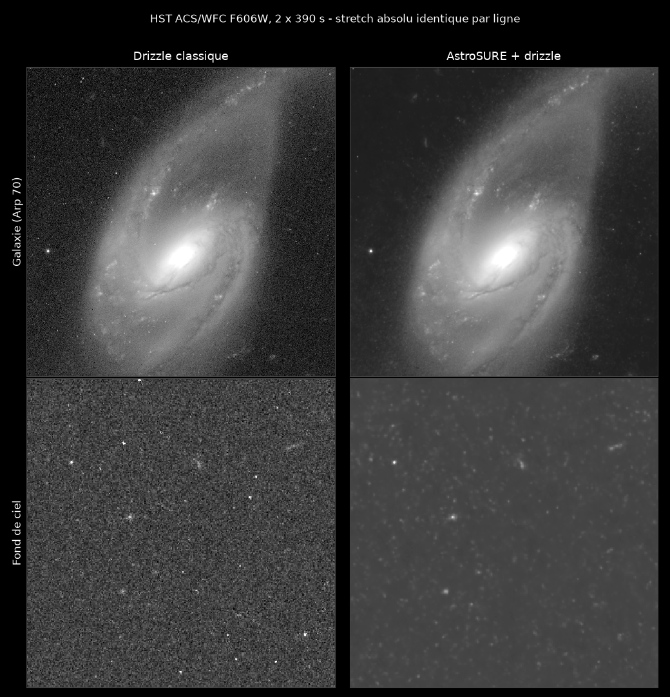
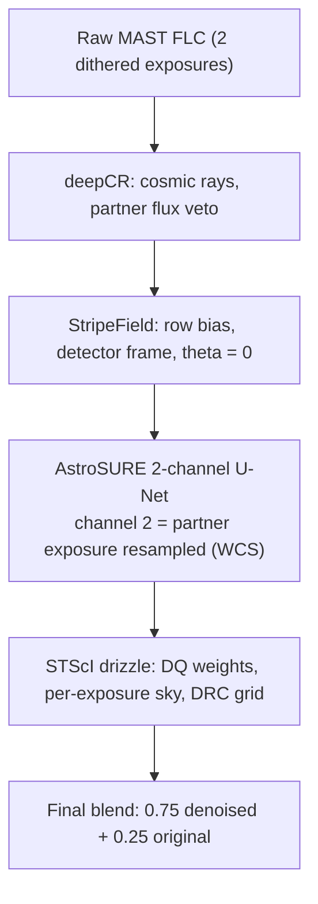
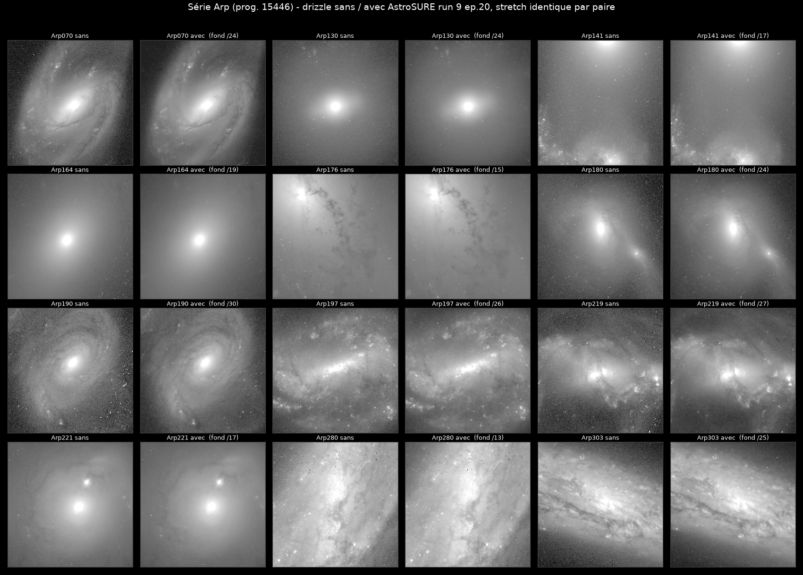
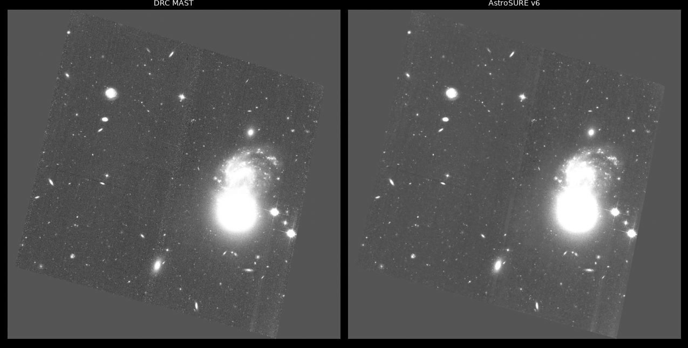

# AstroSURE: Noise2Noise denoising of Hubble ACS/WFC images

AstroSURE denoises Hubble ACS/WFC frames with a small U-Net (~989K
parameters) trained on pairs of dithered exposures of the same field.
The two frames of a pair share the signal but not the noise, so the
signal is the only thing the network can learn
([Noise2Noise](https://arxiv.org/abs/1803.04189), Lehtinen et al. 2018).
No clean reference image is needed anywhere, and inference takes a few
seconds per 4096×2048 chip on a laptop-class GPU (CUDA, Apple Silicon
or CPU).


*Arp 70 (HST ACS/WFC F606W, 2×390 s), same drizzle engine and same grid
on both sides, identical absolute stretch per row: only the AstroSURE
denoising differs. Cosmic rays removed without drizzle rejection,
background ÷24, spiral structure and photometry preserved.*

## Pipeline

From raw MAST FLC files to a final drizzled image, each instrumental
defect is corrected in the domain where it lives:



Run the whole chain with `pipeline/batch_arp.py`, or step by step with
`deepcr_flc.py`, `destripe_flc.py`, `asure2_flc.py`, `drizzle_asure.py`
(see Usage below).

## Quick start

Python 3.13 with the pinned versions in `requirements.txt` (torch,
astropy, drizzle, deepCR, astroscrappy, astroquery...):

```bash
pip install -r requirements.txt
PY=python

# Denoise a single chip (1-channel model, a few seconds)
$PY training/infer.py input_chip.fits training/checkpoints/best.pth output.fits

# Full chain on a pair of FLC exposures (2-channel production model)
$PY pipeline/deepcr_flc.py exp1_flc.fits exp2_flc.fits
$PY pipeline/destripe_flc.py exp1_flc_dcr.fits exp2_flc_dcr.fits
$PY pipeline/asure2_flc.py exp1_flc_dcr_dsf.fits exp2_flc_dcr_dsf.fits

# Then drizzle onto the grid of a reference DRC
$PY pipeline/drizzle_asure.py ref_drc.fits output.fits \
    exp1_flc_dcr_dsf_asure9e20b.fits exp2_flc_dcr_dsf_asure9e20b.fits
```

Trained checkpoints ship with the repository:

- `training/checkpoints/best.pth`: 1-channel model, for a single chip
  or when no partner exposure exists.
- `training/checkpoints_run9/best_qc.pth`: 2-channel production model
  (default of `asure2_flc.py`), which uses the partner exposure as a
  second input channel. The normal Hubble case: you always have at
  least two.

House rule behind `best_qc.pth`: checkpoints are selected by a
photometric quality-control battery (aperture photometry by brightness
tier against Gaia DR3, synthetic probes, full-frame visual plates),
never by validation loss.

## Measured results

End-to-end chain on Arp 70, against the classic drizzle chain on the
same grid, at identical absolute stretch:

| Metric | Result |
|---|---|
| Fine-detail correlation (high-pass, in-galaxy) | 0.890 |
| Star photometry (21 Gaia DR3 stars, median) | 100.4 % |
| High-frequency background noise | ÷32 |
| Cosmic rays (~14 000 per chip) | 99.9 % removed, no drizzle rejection |
| ACS row striping | 0.64 → 0.11 e- |

The pure network output is then blended `0.75*denoised + 0.25*original`
(photometry-safe by construction, both terms estimate the same scene);
the final images land at noise ÷3.3-3.7 with a natural grain. Keep the
un-denoised drizzle next to it and the blend can be re-tuned in
PixelMath at any time.

Thirteen Arp fields processed by one batch script, zero per-field
tuning, identical stretch per pair:



Sanity check against the official archive: at identical absolute
stretch and matched sky level, the AstroSURE product has the same
objects and the same levels as the MAST DRC, only cleaner. Beware of
autostretch (PixInsight/STF): keyed to the image σ, it is ~20× more
aggressive on a denoised image and amplifies residuals that are
invisible on the DRC at the same stretch.



## Limits, honestly

- **Instrument-specific by design.** The shipped checkpoints know
  ACS/WFC FLC frames: electrons, cosmic rays present, detector
  geometry. They are not meant for finished stacks or other cameras.
  For another instrument, download pairs and retrain (scripts
  included, see below).
- Individual faint stars can dip a few percent; saturated cores and
  bleed trails are passed through, not repaired.
- Collapsing the pixel noise reveals the ~1 % low-frequency flat-field
  mottling that was always in the data (the MAST DRC carries the same
  amplitude).

## Training on your own data

`download_mast/` contains the full data pipeline:
`download_hubble_pairs.py` (query and fetch dithered ACS/WFC pairs from
MAST) → `strip_sci.py` → `clean_flc.py` (deduplication, POSTARG
filtering) → `split_chips.py`. Each training file is one chip,
4096×2048 float32.

```bash
# Sanity check the dataset, then train (~2h20 for 50 epochs on an M2 Max)
$PY training/dataset_n2n.py --test
$PY -u training/train.py --mode stack2 \
    --catalog training_data/pairs_catalog_full_raw.json \
    --ckpt-dir training/checkpoints_mynew
```

The preprocessing that makes N2N work on linear astronomical data
(implemented identically in `training/dataset_n2n.py` and the inference
scripts):

1. Conversion to e-/s and per-exposure sky subtraction
2. Joint normalization of each pair (same statistics on both frames),
   scale only, no clipping
3. The input stays a raw crop; only the target is resampled (bilinear)
   onto the input grid (Hubble dithers are deliberately half-pixel)
4. asinh dynamic-range compression (`ASINH_BETA`), inverted at
   inference
5. L1 loss (robust to the cosmic rays of the target)

⚠️ The `pairs_catalog*.json` files contain **absolute paths** to the
training data on the author's machine. To train on your side,
regenerate or rewrite the catalogs for your own tree.

The StripeField destriping engine (`pipeline/destripe_astro.py`) is
vendored from
[BB-Astro Pixinsight_Scripts](https://github.com/BB-Astro/Pixinsight_Scripts)
(same author); set `STRIPEFIELD_DIR` to use an external copy.

## Project notebook

The complete development history (nine training runs, five instructive
failures, and every measurement trap met on the way) is in
`PLAN_ENTRAINEMENT.md`, the project's lab notebook, in French. The
story in English: [bb-astro.com/astrosure](https://bb-astro.com/astrosure).

## License

MIT (see `LICENSE`). Hubble data: program SNAP-15446 (PI J. Dalcanton)
and public HST archives, via MAST.

See also: [DeepImagePriorLinear](https://github.com/BB-Astro/DeepImagePriorLinear),
denoising without any training data, by the same author.
